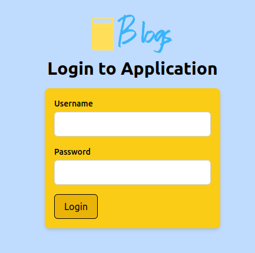

# Blog app



Developed as part of the Helsinki University Full-stack Open course. Currently there is no feature for creating an account via the frontend, you will have to manually do this via backend posting or i.e MongoDB Atlas. Frontend is pretty rough and was not really the main focus, but hey, I got to learn Tailwind a little bit. :D

## Running the app locally

1. **Clone the repository**
2. **Create an .env file in the backend folder**
2. **Set up the following values in your .env file**:
    ```
    SECRET=your_secret_string
    PORT=your_chosen_port
    TEST_MONGO_DB_URI=your_test_database_url
    MONGO_DB_URI=your_main_database_url
    ```

    Replace the placeholders with the following:
    - `your_secret_string`: Any string value without special characters for your secret.
    - `your_chosen_port`: The port number you want your backend to run on.
    - `your_test_database_url`: URL for your test MongoDB database.
    - `your_main_database_url`: URL for your main MongoDB database.
3. **Run npm install, this will install all required dependencies**
4. **You can run the backend and frontend seperately by using npm run dev command, alternatively, there is a script for running both simultaneously (start.sh)**

> [!WARNING]
> Never push the .env file to your GitHub repository
